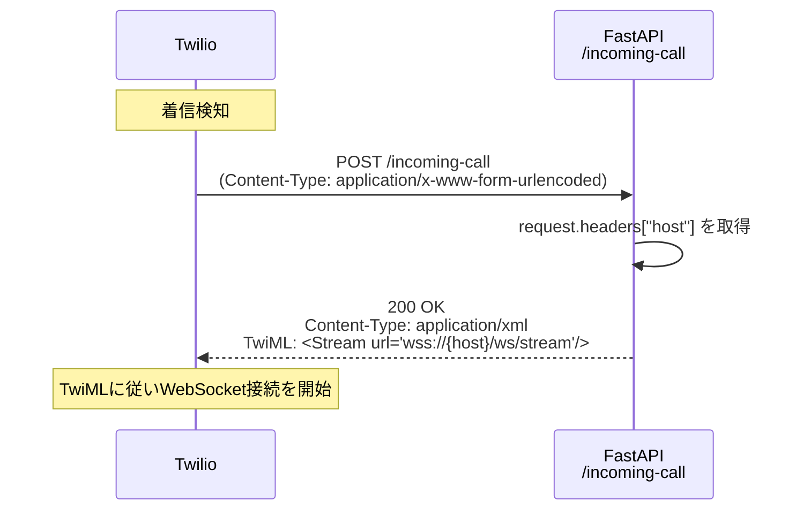
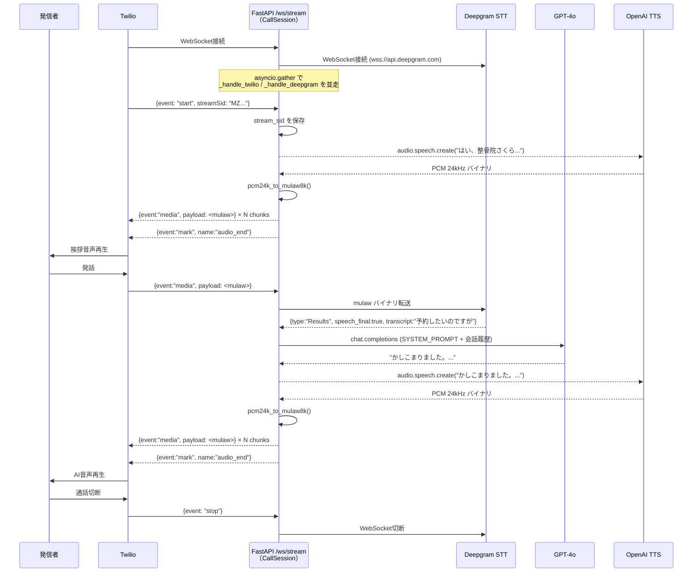
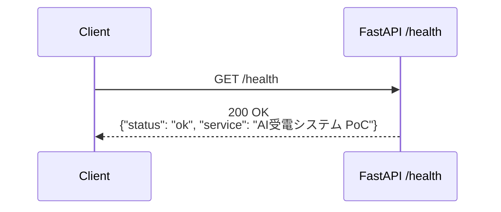

# API仕様書 — AI受電システム PoC

**バージョン**: 1.0.0
**作成日**: 2026-04-02
**ベースURL**: `https://{host}` （Nginx SSL終端後）

---

## エンドポイント一覧

| メソッド | パス | 種別 | 説明 |
|---------|------|------|------|
| POST | `/incoming-call` | HTTP | Twilio着信Webhook |
| WS | `/ws/stream` | WebSocket | Twilio Media Streams |
| GET | `/health` | HTTP | ヘルスチェック |

---

## 1. POST /incoming-call

### 概要

Twilioが電話着信を検知した際に呼び出すWebhookエンドポイント。
TwiML（XML）を返却し、Twilioに対してメディアストリームの開始を指示する。

### リクエスト

| 項目 | 値 |
|------|-----|
| メソッド | `POST` |
| Content-Type | `application/x-www-form-urlencoded`（Twilio標準） |
| 認証 | なし（Twilioからの送信）※TBD-001参照 |

**Twilioが送信する主要フォームパラメータ（参考）**

| パラメータ名 | 型 | 説明 |
|------------|-----|------|
| `CallSid` | string | 通話の一意識別子 |
| `From` | string | 発信者番号 |
| `To` | string | 着信番号（Twilio購入番号） |
| `CallStatus` | string | 通話状態（`ringing` 等） |

> 現在の実装ではこれらのパラメータは利用していない。使用するのは `request.headers.get("host")` のみ。

### レスポンス

| 項目 | 値 |
|------|-----|
| ステータスコード | `200 OK` |
| Content-Type | `application/xml` |

**レスポンスボディ（TwiML）**

```xml
<?xml version="1.0" encoding="UTF-8"?>
<Response>
    <Connect>
        <Stream url="wss://{host}/ws/stream"/>
    </Connect>
</Response>
```

- `{host}` はリクエストの `Host` ヘッダーから取得する
- このTwiMLによりTwilioは `/ws/stream` にWebSocket接続を開始する

### エラーケース

| ケース | 挙動 |
|--------|------|
| FastAPIサーバーダウン | Twilioがエラーとして処理（通話は切断される） |
| `host` ヘッダー欠落 | フォールバック `localhost` を使用（Stream URLが不正になる恐れあり） |

### シーケンス図



---

## 2. WS /ws/stream

### 概要

Twilio Media Streams プロトコルに準拠したWebSocketエンドポイント。
1通話につき1つの `CallSession` インスタンスを生成し、音声ストリームの双方向処理を行う。

### 接続

| 項目 | 値 |
|------|-----|
| プロトコル | `wss://` （Nginx SSL終端後は `ws://127.0.0.1:8000`） |
| 認証 | なし（Twilioからの接続） |
| 接続元 | Twilio Media Streams サービス |

### メッセージフォーマット（受信）

Twilioからのメッセージはすべて JSON テキストフレームで送受信される。

#### start イベント

通話セッション開始時に1回送信される。

```json
{
  "event": "start",
  "start": {
    "streamSid": "MZxxxxxxxxxxxxxxxxxxxxxxxxxxxxxxxx",
    "accountSid": "ACxxxxxxxxxxxxxxxxxxxxxxxxxxxxxxxx",
    "callSid": "CAxxxxxxxxxxxxxxxxxxxxxxxxxxxxxxxx",
    "tracks": ["inbound"],
    "customParameters": {}
  }
}
```

| フィールド | 型 | 説明 |
|-----------|-----|------|
| `event` | string | `"start"` 固定 |
| `start.streamSid` | string | ストリームセッションID。以降の送信に使用 |

#### media イベント

音声データ受信時に継続的に送信される。

```json
{
  "event": "media",
  "media": {
    "track": "inbound",
    "chunk": "1",
    "timestamp": "5",
    "payload": "<base64エンコードされたmulaw 8kHz音声>"
  }
}
```

| フィールド | 型 | 説明 |
|-----------|-----|------|
| `event` | string | `"media"` 固定 |
| `media.payload` | string | base64エンコード mulaw 8kHz 音声バイナリ |

#### stop イベント

通話終了時に送信される。

```json
{
  "event": "stop",
  "stop": {
    "accountSid": "ACxxxxxxxxxxxxxxxxxxxxxxxxxxxxxxxx",
    "callSid": "CAxxxxxxxxxxxxxxxxxxxxxxxxxxxxxxxx"
  }
}
```

### メッセージフォーマット（送信）

FastAPIからTwilioへ送信するJSONメッセージ。

#### media イベント（AI音声送信）

```json
{
  "event": "media",
  "streamSid": "MZxxxxxxxxxxxxxxxxxxxxxxxxxxxxxxxx",
  "media": {
    "payload": "<base64エンコードされたmulaw 8kHz音声>"
  }
}
```

| フィールド | 型 | 説明 |
|-----------|-----|------|
| `streamSid` | string | `start` イベントで取得したSID |
| `media.payload` | string | AI音声（mulaw 8kHz, base64） |

チャンクサイズ: **3200 bytes**（定数 `AUDIO_CHUNK_SIZE`）

#### mark イベント（音声送信完了通知）

```json
{
  "event": "mark",
  "streamSid": "MZxxxxxxxxxxxxxxxxxxxxxxxxxxxxxxxx",
  "mark": {
    "name": "audio_end"
  }
}
```

音声チャンク全送信後に送信し、Twilioに再生完了を通知する。

#### clear イベント（音声キュークリア）

```json
{
  "event": "clear",
  "streamSid": "MZxxxxxxxxxxxxxxxxxxxxxxxxxxxxxxxx"
}
```

Twilioの再生キューをクリアする（割り込み対応用）。現状は `_clear_audio()` メソッドとして実装済みだが呼び出し箇所は未使用。

### 処理フロー

| イベント | 処理内容 |
|---------|---------|
| WebSocket接続 | `CallSession` インスタンス生成、Deepgram WebSocket接続開始 |
| `start` | `stream_sid` を保存、挨拶音声 `_speak(GREETING)` を非同期タスクとして実行 |
| `media` | AI発話中でなければ音声バイナリをDeepgramへ転送 |
| `stop` | ループを抜けてセッション終了 |
| WebSocket切断 | 例外をキャッチしてWebSocketをクローズ |

### エラーケース

| ケース | 挙動 |
|--------|------|
| Deepgram接続失敗 | `CallSession.run()` が例外をキャッチしてログ出力後に終了 |
| LLM APIエラー | `_process_user_input()` が例外をキャッチしてログ出力（通話は継続） |
| TTS APIエラー | `_speak()` が例外をキャッチしてログ出力、`is_ai_speaking=False` にリセット |
| Deepgram切断 | `websockets.ConnectionClosed` をキャッチして `_handle_twilio()` ループ終了 |

### シーケンス図



---

## 3. GET /health

### 概要

サーバーの動作確認用エンドポイント。デプロイ後の疎通確認やロードバランサーのヘルスチェックに使用する。

### リクエスト

| 項目 | 値 |
|------|-----|
| メソッド | `GET` |
| 認証 | なし |
| パラメータ | なし |

### レスポンス

| 項目 | 値 |
|------|-----|
| ステータスコード | `200 OK` |
| Content-Type | `application/json` |

**レスポンスボディ**

```json
{
  "status": "ok",
  "service": "AI受電システム PoC"
}
```

### エラーケース

| ケース | 挙動 |
|--------|------|
| サーバーダウン | TCP接続失敗（Nginxが502 Bad Gatewayを返す） |

### シーケンス図



---

## 4. TBD一覧

| ID | 内容 | 優先度 |
|----|------|-------|
| TBD-001 | Twilio Webhook署名検証（`X-Twilio-Signature` 検証）の実装 | 高 |
| TBD-004 | AI発話中の割り込み処理（`_clear_audio()` の呼び出し条件定義） | 中 |
| TBD-005 | `/health` エンドポイントへの外部API接続確認の追加（Deepgram/OpenAI疎通チェック） | 低 |
