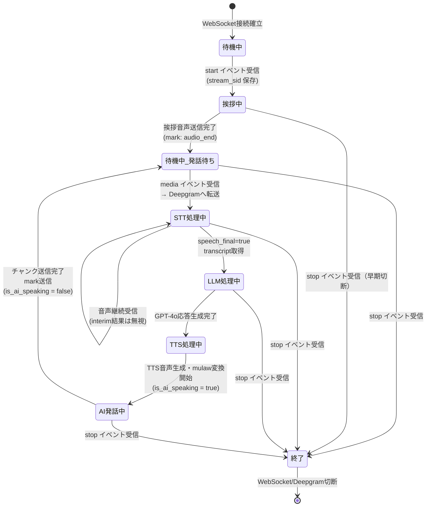

# コンポーネント仕様書 — AI受電システム PoC

**バージョン**: 1.0.0
**作成日**: 2026-04-02

---

## 1. CallSession クラス（`call_handler.py`）

### 1.1 概要

1通話に対して1つのインスタンスが生成される。Twilio WebSocketとDeepgram WebSocketを並走させ、STT→LLM→TTSのパイプラインを制御する。

### 1.2 インスタンス変数

| 変数名 | 型 | 初期値 | 説明 |
|--------|-----|--------|------|
| `ws` | `fastapi.WebSocket` | コンストラクタ引数 | TwilioとのWebSocket接続 |
| `client` | `openai.AsyncOpenAI` | コンストラクタ引数 | OpenAI APIクライアント（GPT-4o / TTS共用） |
| `stream_sid` | `str \| None` | `None` | Twilioのストリームセッション識別子（`start` イベントで設定） |
| `deepgram_ws` | WebSocket接続 \| None | `None` | Deepgramとの接続オブジェクト |
| `conversation` | `list[dict]` | `[]` | 会話履歴（`{"role": "user"/"assistant", "content": "..."}` の配列） |
| `is_ai_speaking` | `bool` | `False` | AI音声再生中フラグ（Deepgramへの転送を停止するために使用） |

### 1.3 メソッド一覧

| メソッド | 種別 | 説明 |
|---------|------|------|
| `__init__(websocket, client)` | コンストラクタ | 変数初期化 |
| `run()` | `async` / public | エントリーポイント。Deepgram接続確立後 `_handle_twilio` と `_handle_deepgram` を `asyncio.gather` で並走 |
| `_handle_twilio()` | `async` / private | Twilio WebSocket受信ループ。`start`/`media`/`stop` イベントを処理 |
| `_handle_deepgram()` | `async` / private | Deepgram WebSocket受信ループ。`speech_final=true` の文字起こし結果を `_process_user_input` へ渡す |
| `_process_user_input(text)` | `async` / private | GPT-4oで応答生成し会話履歴に追記。`_speak()` を呼び出す |
| `_speak(text)` | `async` / private | OpenAI TTSで音声生成→mulaw変換→Twilioへチャンク送信。送信中は `is_ai_speaking=True` |
| `_clear_audio()` | `async` / private | Twilioの再生キュークリア（`clear` イベント送信）。現状は未呼び出し |

### 1.4 LLM設定定数

| 定数名 | 値 | 説明 |
|--------|-----|------|
| `LLM_MODEL` | `"gpt-4o"` | 使用するOpenAIモデル |
| `TTS_MODEL` | `"tts-1"` | TTSモデル |
| `TTS_VOICE` | `"nova"` | TTS音声（日本語対応） |
| `AUDIO_CHUNK_SIZE` | `3200` | Twilioへの1送信チャンクサイズ（bytes） |

**GPT-4o呼び出しパラメータ**

| パラメータ | 値 |
|-----------|-----|
| `model` | `gpt-4o` |
| `max_tokens` | `200` |
| `temperature` | `0.7` |
| メッセージ構成 | `system`（SYSTEM_PROMPT）+ `conversation` 履歴全件 |

### 1.5 AI発話中の割り込み防止

`is_ai_speaking` フラグが `True` の間、`_handle_twilio()` は `media` イベントをDeepgramに転送しない。これにより、AI音声再生中に発信者の声を拾ってしまうことを防ぐ簡易実装となっている。

> **TBD-004**: 発信者が割り込んで話した場合の `_clear_audio()` 呼び出しロジックは未実装。

---

## 2. audio_utils モジュール（`audio_utils.py`）

### 2.1 概要

OpenAI TTSが出力するPCM音声をTwilio（およびDeepgram）が要求するmulaw 8kHz形式に変換するユーティリティモジュール。

### 2.2 関数仕様

#### `pcm24k_to_mulaw8k(pcm_data: bytes) -> bytes`

| 項目 | 詳細 |
|------|------|
| 入力 | PCM raw バイナリ（24kHz、16bit、mono） |
| 出力 | mulaw エンコード バイナリ（8kHz） |
| 変換ステップ1 | `audioop.ratecv(pcm_data, 2, 1, 24000, 8000, None)` — 24kHz→8kHz ダウンサンプリング（サンプル幅 2bytes = 16bit、チャンネル数 1） |
| 変換ステップ2 | `audioop.lin2ulaw(resampled, 2)` — linear PCM→mulaw エンコード |
| 依存ライブラリ | `audioop`（Python 3.12以下）または `audioop-lts`（Python 3.13以上） |

### 2.3 音声フォーマット対応表

| 区分 | サンプルレート | ビット深度 | チャンネル | エンコーディング |
|------|-------------|-----------|-----------|---------------|
| Twilio受信（発信者音声） | 8kHz | 8bit | mono | mulaw |
| Deepgram受信 | 8kHz | 8bit | mono | mulaw（Twilioから直接転送） |
| OpenAI TTS出力 | 24kHz | 16bit | mono | PCM（raw） |
| Twilio送信（AI音声） | 8kHz | 8bit | mono | mulaw（`pcm24k_to_mulaw8k` 変換後） |

### 2.4 依存関係の互換性

```python
try:
    import audioop                # Python <= 3.12
except ImportError:
    import audioop_lts as audioop # Python >= 3.13（pip install audioop-lts）
```

Python 3.13以上の環境では `requirements.txt` に `audioop-lts` の追加が必要。
> **TBD-006**: `requirements.txt` に `audioop-lts` が未記載。Python 3.13環境でのランタイムエラーリスクあり。

---

## 3. scenarios モジュール（`scenarios.py`）

### 3.1 概要

AIの振る舞いを定義する設定ファイル。店舗情報・FAQ・対応ルールを変更するだけで、異なる業種・店舗向けにシステムを転用できる。

### 3.2 定義項目一覧

| 変数名 | 型 | 説明 |
|--------|-----|------|
| `STORE_NAME` | `str` | 店舗名（例: `"整骨院さくら"`）。SYSTEM_PROMPTとGREETINGに自動挿入 |
| `STORE_INFO` | `str` | 営業時間・住所・メニュー・料金情報（改行区切りのテキスト） |
| `FAQ_KNOWLEDGE` | `str` | Q&A形式のFAQ知識ベース |
| `SYSTEM_PROMPT` | `str` | GPT-4oに渡すシステムプロンプト（`STORE_NAME` / `STORE_INFO` / `FAQ_KNOWLEDGE` を埋め込み） |
| `GREETING` | `str` | 着信時の第一声（`start` イベント受信後に即座に再生） |

### 3.3 SYSTEM_PROMPT の構成

```
あなたは「{STORE_NAME}」の電話受付AIアシスタントです。
[言語ルール]
[店舗情報] ← STORE_INFO
[FAQ知識] ← FAQ_KNOWLEDGE
[対応ルール]
  1. 1回の発言は3文以内
  2. 相槌ワード指定
  3. 予約受付時の確認項目（氏名・日時・メニュー・電話番号）
  4. 予約復唱ルール
  5. 転送・取次なし
  6. クレーム時の折り返し対応
[営業電話への断り文言]
[多言語対応ルール]
```

### 3.4 カスタマイズガイド

#### 店舗情報の変更

`STORE_NAME`、`STORE_INFO` を編集するだけでサーバー再起動後に反映される。

```python
STORE_NAME = "新しい店舗名"
STORE_INFO = """
- 営業時間: ...
- 住所: ...
- メニュー: ...
"""
```

#### FAQの追加・変更

`FAQ_KNOWLEDGE` に Q&A 形式で追記する。

```python
FAQ_KNOWLEDGE = """
Q: 既存の質問？
A: 既存の回答。

Q: 新しい質問？
A: 新しい回答。
"""
```

#### 対応ルールの変更

`SYSTEM_PROMPT` 内の `【対応ルール】` セクションを直接編集する。変更の際はシステムプロンプト全体の整合性を確認すること。

#### 挨拶文の変更

```python
GREETING = f"お電話ありがとうございます。{STORE_NAME}でございます。"
```

---

## 4. 通話フロー状態遷移図



### 状態説明

| 状態 | 説明 |
|------|------|
| 待機中 | WebSocket接続済み、Deepgram接続中、`start` イベント待ち |
| 挨拶中 | `start` イベント受信後、GREETING テキストをTTSで音声生成・送信中 |
| 待機中_発話待ち | 挨拶または前の応答完了後、発信者の発話を待っている状態 |
| STT処理中 | 発信者の音声をDeepgramへ転送中。`speech_final=true` を待っている |
| LLM処理中 | GPT-4oに応答生成をリクエスト中 |
| TTS処理中 | OpenAI TTSで音声生成中・mulaw変換中 |
| AI発話中 | Twilioへ音声チャンクを送信中（`is_ai_speaking=True`）。この間Deepgramへの転送は停止 |
| 終了 | `stop` イベント受信またはエラーによるセッション終了 |

---

## 5. モジュール間の依存関係

```
main.py
├── call_handler.py (CallSession)
│   ├── audio_utils.py (pcm24k_to_mulaw8k)
│   └── scenarios.py (SYSTEM_PROMPT, GREETING)
├── openai (AsyncOpenAI client) ← main.pyで初期化して注入
└── fastapi (WebSocket)
```

---

## 6. TBD一覧

| ID | 内容 | 優先度 |
|----|------|-------|
| TBD-004 | AI発話中に発信者が割り込んだ場合の `_clear_audio()` 呼び出し条件の定義・実装 | 中 |
| TBD-006 | `requirements.txt` への `audioop-lts` 追加（Python 3.13以上対応） | 中 |
| TBD-007 | 会話履歴の長期化によるトークン超過対応（履歴の要約・切り詰め戦略） | 中 |
| TBD-008 | `_clear_audio()` の実装は存在するが未呼び出し。削除または有効化を判断 | 低 |
