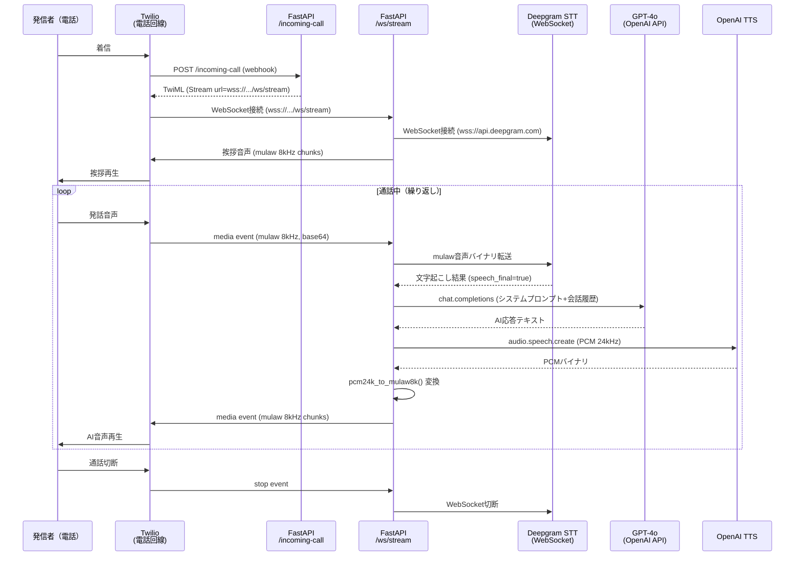
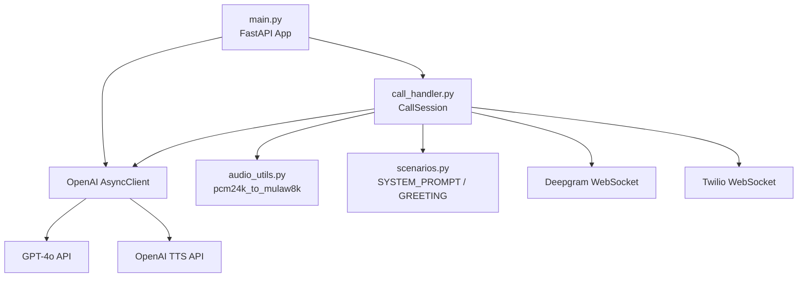

# システム概要書 — AI受電システム PoC

**バージョン**: 1.0.0
**作成日**: 2026-04-02
**対象システム**: AI受電システム PoC（整骨院さくら向け）

---

## 1. システム概要

本システムは、Twilio による電話着信を受け付け、Deepgram による音声認識（STT）、GPT-4o による自然言語応答生成（LLM）、OpenAI TTS による音声合成（TTS）を組み合わせて、AIが自動で電話応対を行うバックエンド専用システムである。

- フロントエンド: なし
- データベース: なし（会話履歴はインメモリのみ。1通話 = 1インスタンス）
- デプロイ先: AWS EC2（Ubuntu 22.04/24.04）
- 公開プロトコル: HTTPS（Nginx リバースプロキシ + Let's Encrypt SSL）

---

## 2. アーキテクチャ概要

### 2.1 コンポーネント一覧

| コンポーネント | 役割 | 実装 |
|-------------|------|------|
| Twilio | 電話回線・メディアストリーム提供 | 外部SaaS |
| FastAPI / Uvicorn | Webサーバー・エンドポイント定義 | `main.py` |
| CallSession | 1通話の状態管理・処理オーケストレーション | `call_handler.py` |
| Deepgram STT | 音声→テキスト変換（日本語対応） | 外部API（WebSocket） |
| GPT-4o | 自然言語応答生成 | 外部API（OpenAI） |
| OpenAI TTS | テキスト→音声合成 | 外部API（OpenAI） |
| audio_utils | 音声フォーマット変換（PCM 24kHz → mulaw 8kHz） | `audio_utils.py` |
| scenarios | システムプロンプト・店舗情報・FAQ定義 | `scenarios.py` |
| Nginx | リバースプロキシ・SSL終端・WebSocket昇格 | `deploy/nginx.conf` |

### 2.2 データフロー図



### 2.3 コンポーネント間の依存関係図



---

## 3. 環境変数一覧

`.env.example` より抽出。本番環境では `.env` ファイルに設定する。
systemd サービスでは `EnvironmentFile=/home/ubuntu/AI_phone_poc/.env` から読み込む。

| 変数名 | 説明 | 必須 | 例 |
|--------|------|------|-----|
| `OPENAI_API_KEY` | OpenAI API認証キー（GPT-4o / TTS共用） | 必須 | `sk-xxx...` |
| `DEEPGRAM_API_KEY` | Deepgram API認証キー（STT） | 必須 | `abc123...` |
| `TWILIO_ACCOUNT_SID` | Twilio アカウントSID | 必須 | `ACxxx...` |
| `TWILIO_AUTH_TOKEN` | Twilio 認証トークン | 必須 | `xxx...` |
| `TWILIO_PHONE_NUMBER` | Twilio 購入済み電話番号 | 必須 | `+1xxxxxxxxxx` |

> **TBD-001**: Twilio Webhook のリクエスト署名検証（`TWILIO_AUTH_TOKEN` を使った `X-Twilio-Signature` 検証）は現在未実装。本番運用前に実装要否を確認すること。

---

## 4. 外部API依存関係一覧

| サービス | エンドポイント | プロトコル | 認証方式 | 用途 |
|---------|-------------|-----------|---------|------|
| Twilio | `POST /incoming-call` (受信) | HTTPS webhook | なし（Twilio側から送信） | 着信通知・TwiML返却 |
| Twilio Media Streams | `wss://{host}/ws/stream` | WebSocket（Secure） | なし（Twilio側から接続） | 音声ストリーム双方向通信 |
| Deepgram | `wss://api.deepgram.com/v1/listen` | WebSocket（Secure） | Bearer Token（`Authorization: Token {DEEPGRAM_API_KEY}`） | リアルタイム音声認識 |
| OpenAI Chat | `https://api.openai.com/v1/chat/completions` | HTTPS | Bearer Token（`OPENAI_API_KEY`） | GPT-4o 応答生成 |
| OpenAI TTS | `https://api.openai.com/v1/audio/speech` | HTTPS | Bearer Token（`OPENAI_API_KEY`） | テキスト→音声合成 |

### Deepgram 接続パラメータ

| パラメータ | 値 | 説明 |
|-----------|-----|------|
| `language` | `ja` | 日本語認識 |
| `model` | `nova-2` | 高精度モデル |
| `encoding` | `mulaw` | Twilioと同フォーマット |
| `sample_rate` | `8000` | 8kHz |
| `endpointing` | `500` | 500ms無音で発話終了判定 |
| `interim_results` | `false` | 確定結果のみ受信 |

---

## 5. デプロイ構成

```
インターネット
    ↓ HTTPS/WSS (443)
[Nginx] — Let's Encrypt SSL終端
    ↓ HTTP/WS (127.0.0.1:8000)
[Uvicorn + FastAPI]
    ↓
[CallSession × N（通話数分）]
```

- **Nginx設定**: `deploy/nginx.conf`
  - WebSocket昇格: `Upgrade` / `Connection: upgrade` ヘッダーを転送
  - タイムアウト: `proxy_read_timeout 3600s`（長時間通話対応）
- **systemd設定**: `deploy/ai_phone.service`
  - ユーザー: `ubuntu`
  - 自動再起動: `Restart=always`、`RestartSec=5`
- **ドメイン**: `{ELASTIC_IP//./-}.sslip.io` 形式（sslip.io を利用した無料サブドメイン）

---

## 6. 非機能要件（現状確認）

| 項目 | 現状値 / 設計 |
|------|-------------|
| 同時接続数 | TBD-002: 未計測。1プロセス・asyncioで複数通話を並行処理 |
| レイテンシ目標 | TBD-003: 未定義。STT + LLM + TTS の合計遅延が体感品質に直結 |
| 永続化 | なし（会話履歴はプロセスメモリのみ） |
| 認証 / セキュリティ | TBD-001: Twilio署名検証未実装 |
| ログ | Python標準 `logging`（INFO/ERROR）。structuredログ未対応 |
| 監視 | なし（`/health` エンドポイントのみ） |

---

## 7. TBD一覧

| ID | 内容 | 優先度 |
|----|------|-------|
| TBD-001 | Twilio Webhook署名検証の実装要否 | 高 |
| TBD-002 | 同時通話数の上限・負荷試験実施 | 中 |
| TBD-003 | 応答レイテンシ目標値の定義 | 中 |
